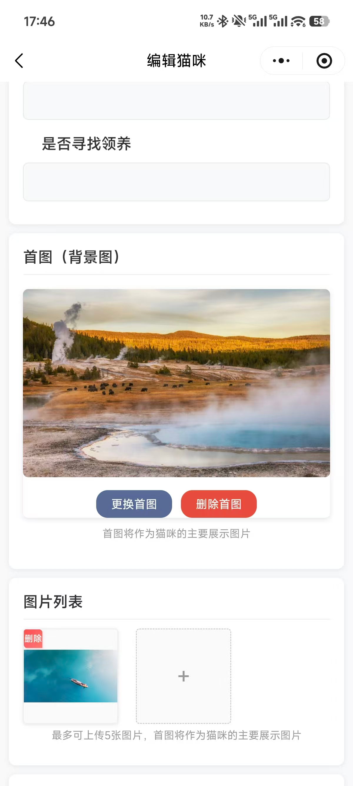
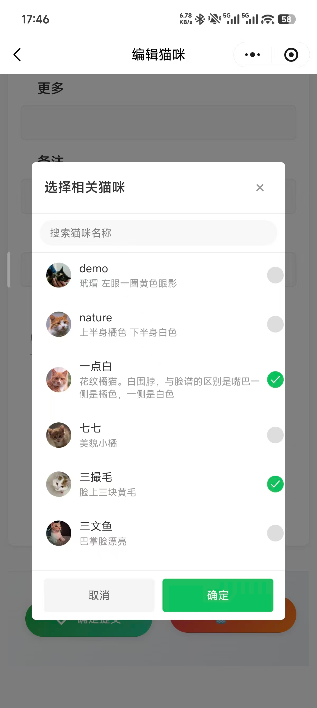
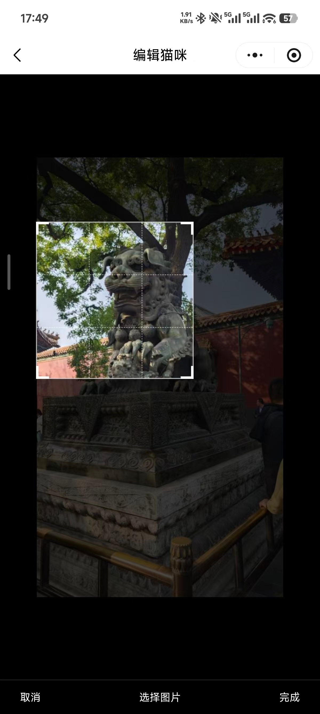

# Ucats

## 2025 11 30 更新
1、增加了猫咪信息添加和编辑过程中的图片上传编辑功能、便于信息编辑
2、图片支持压缩、头像裁剪
3、优化了整体编辑页面

此小程序基于北大猫协源码开发，致敬原开发者Circle

使用说明见 https://gitee.com/circlelq/yan-yuan-mao-su-cha-shou-ce/wikis/Home

小程序视频教程： https://www.bilibili.com/video/BV16b4y1S7PN

## 后管功能使用
1、管理员进入页面后 在首页右下角点击进入管理员模式，可以选择添加猫咪或者点击猫咪详情进行编辑，体验编辑功能及图片编辑功能  
2、管理员逻辑和北大猫咪原本逻辑一致
3、图片编辑原理：用户上传图片，压缩图片，点击提交，将相关图片提交到腾讯云云存储，等待上传图片上传成功后，将相关路径存储到阿里云数据库。
4、图片头像裁剪利用 @dw/wx-cropper 组件

## TODO 
- 分包 找回关系图
- 自动化绘制关系图 [需要进一步考虑]

## 关于我们

### 小程序

**Ucats**

### 公众号

[果壳猫协] 关注更多果壳猫猫故事 还有果壳流浪动物救助群

[国科大吃喝玩乐学] 关于国科大吃喝玩乐学的一切，选课、经验分享、科研软件、谈恋爱、校园通讯录……更多干货欢迎你来。

