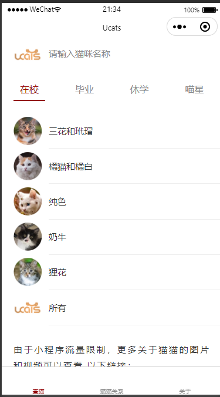
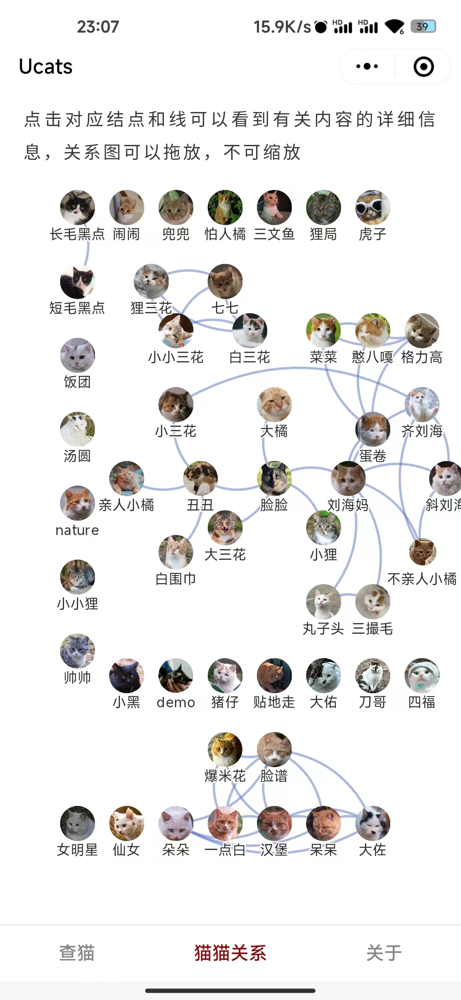
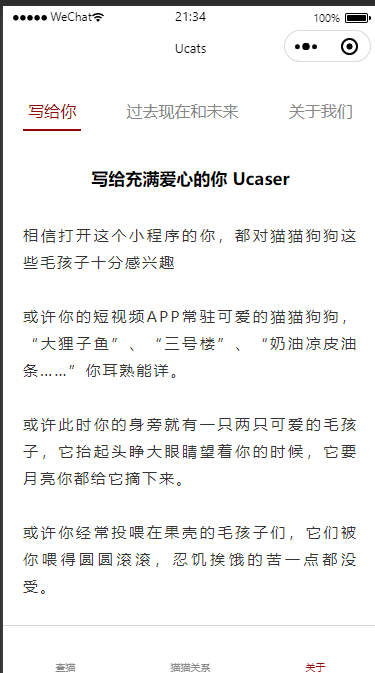

# Ucats

此小程序基于北大猫协源码开发，致敬原开发者Circle

使用说明见 https://gitee.com/circlelq/yan-yuan-mao-su-cha-shou-ce/wikis/Home

小程序视频教程： https://www.bilibili.com/video/BV16b4y1S7PN

## TODO 

- 关系页 图片加载过慢问题
  - 原因 应该是图片加载过多而不是加载数据量大的原因
  - 尝试解决方案
    - 预加载    
    - 本地加载  `require(path)` 这种形式在小程序不起作用
    - 转为dataURI格式  

- 文件优化
  - 代码文件尽量不出现中文
  - 部分模版数据、python文件 和小程序文件分开
  - 开发版本和上传版本分开
- 自动化绘制关系图 [需要进一步考虑]

## 关于我们

### 小程序

**Ucats**

### 公众号

[果壳猫协] 关注更多果壳猫猫故事 还有果壳流浪动物救助群

[国科大吃喝玩乐学] 关于国科大吃喝玩乐学的一切，选课、经验分享、科研软件、谈恋爱、校园通讯录……更多干货欢迎你来。

