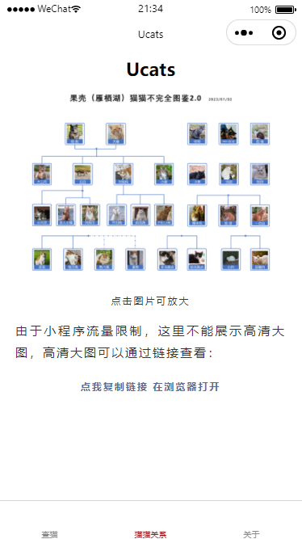
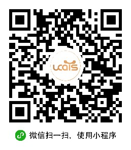

# Ucats

此小程序基于北大猫协源码开发，致敬原开发者Circle

使用说明见 https://gitee.com/circlelq/yan-yuan-mao-su-cha-shou-ce/wikis/Home

小程序视频教程： https://www.bilibili.com/video/BV16b4y1S7PN

## 关于我们

### 小程序

**Ucats**

### 公众号

[果壳猫协] 关注更多果壳猫猫故事 还有果壳流浪动物救助群

[国科大吃喝玩乐学] 关于国科大吃喝玩乐学的一切，选课、经验分享、科研软件、谈恋爱、校园通讯录……更多干货欢迎你来。

